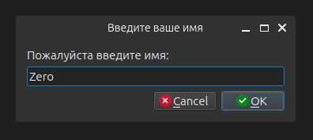
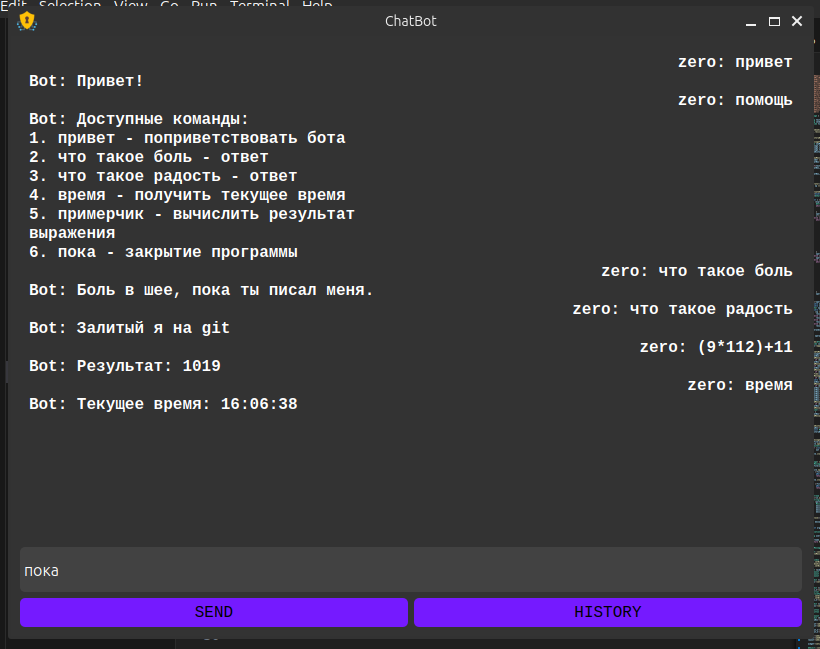
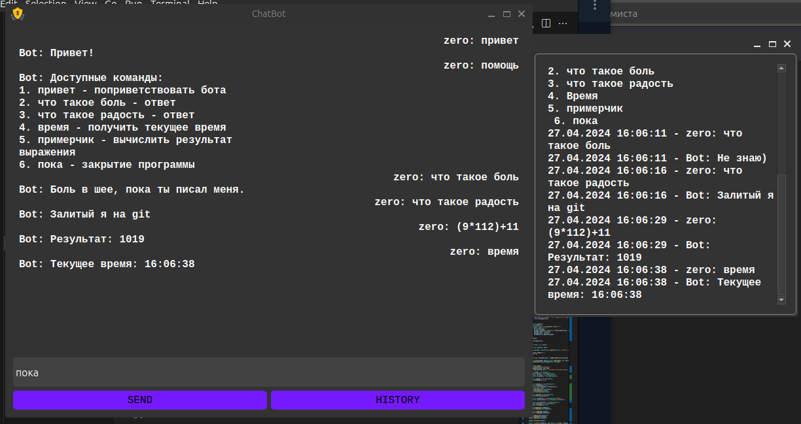
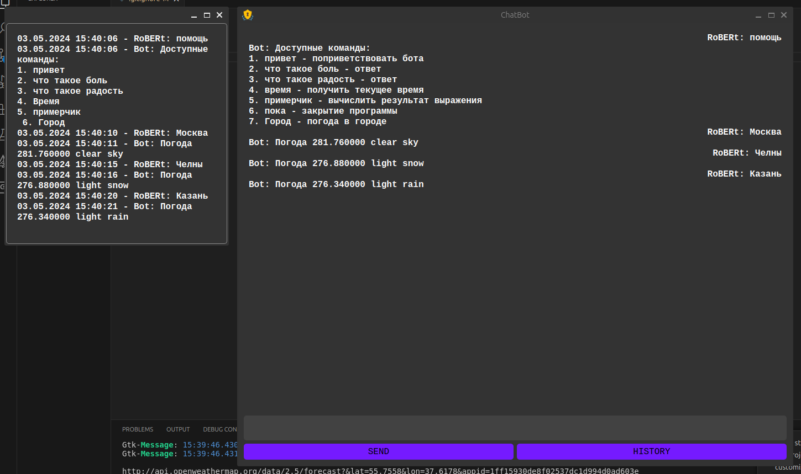

# Лабораторная по созданию простого чат-бота.

1. InputDiolog окно для указания ника, чтобы в последующем подгрузить или сохранить историю сообщений.
   >

2. Главное окно для общения с ботом.
   >

3. Окно с сохраненной историей общения с ботом.
   >

------------------------------------------------
## 1. Добавил функцию получения погоды в городе.
   >
